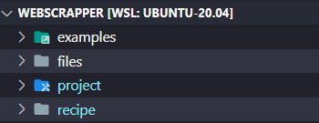
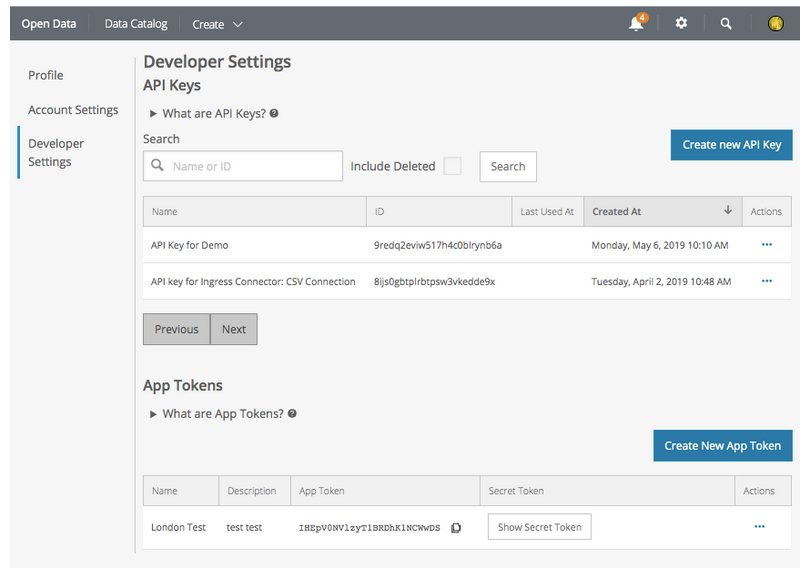
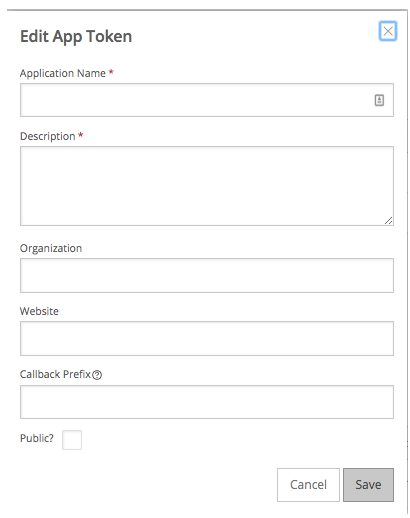

# Proyecto Web Scrapper Profesional 💻
### Estructura 
- El proyecto se compone de 4 grandes directorios

- **examples** Contiene archivos de prueba .py que ejemplifican algunos conceptos como hacer solicitudes http_request o decodificar un json no estructurado.

    ```bash
    examples/
    ├── clean_data_ex.py
    ├── file_handling_size.py
    ├── handling_files.py
    ├── http_request_ex.py
    ├── http_request_ex_datagov.py
    ├── http_scrapper_files_ex.py
    ├── per_ex_j.json
    ├── personal.json
    └── test_decoder_json.py 
    ```
- **files** Contiene documentacion acerca de las librerias que se han usado y conceptos que funcionan como presaberes

    ```bash
    files/
    ├── DOC01QueEsWebScraping.txt
    ├── DOC02PythonYWebScraping
    ├── DOC03HTTP.txt
    ├── DOC04HTMLEssentials.txt
    ├── DOC05Robots.txt
    ├── DOC06Xpath.txt
    ├── DOC07XpressionsXpath.txt
    ├── DOC08EntornoVirtual.txt
    ├── DOC09DependenciasPython.txt
    ├── DOC10ApiSODA.txt
    └── DOC11PageObjectPattern.txt
    ```
- **project** Es el core del proyecto, aquí se encuentran los directorios y ficheros que contienen el proceso de ETL, credenciales, variables de entorno y los scrips necesarios para inicializar la automatización del scrapper. Algunos archivos no estarán disponibles en el repositorio público debido a la confidencialidad de esto, tales como llaves privadas y credenciales.

    ```bash
    project/
    ├── Acc.txt
    ├── ETL
    │   ├── RawFiles
    │   │   ├── clean_ds_031220210001.csv
    │   │   ├── clean_ds_031220210026.csv
    │   │   ├── clean_ds_161220212256.csv
    │   │   ├── ds_saber_11_2020_1_031220210000.csv
    │   │   ├── ds_saber_11_2020_1_031220210024.csv
    │   │   ├── ds_saber_11_2020_1_161220212256.csv
    │   │   ├── labels_saber_11_2020_1_031220210000.txt
    │   │   ├── labels_saber_11_2020_1_031220210024.txt
    │   │   └── labels_saber_11_2020_1_161220212256.txt
    │   ├── __pycache__
    │   │   ├── credentials.cpython-38.pyc
    │   │   ├── job_ext_rnvb_vnyh.cpython-38.pyc
    │   │   └── job_trf_rnvb_vnyh.cpython-38.pyc
    │   ├── credentials.py
    │   ├── job_ext_rnvb_vnyh.py
    │   └── job_trf_rnvb_vnyh.py
    ├── TokenApp.txt
    ├── robot_datos_abiertos.txt
    └── web_scrapper_labels
        ├── __pycache__
        │   ├── common.cpython-38.pyc
        │   ├── data_page_objects.cpython-38.pyc
        │   ├── dataset_rows.cpython-38.pyc
        │   ├── functions_handling.cpython-38.pyc
        │   ├── trf_json_list.cpython-38.pyc
        │   └── vap_route.cpython-38.pyc
        ├── common.py
        ├── config.yaml
        ├── data_page_objects.py
        ├── dataset_rows.py
        ├── functions_handling.py
        ├── main.py
        ├── trf_json_list.py
        ├── unstructured_labels.json
        └── vap_route.py
    ```
- **recipe** Este directorio es el encargado de producir el exploramiento de los datos, validaciones e implementación de modelos de ML.  
    ```bash
    recipe/
    ├── AnalisisExploratorio.ipynb
    ├── DataWrangling.ipynb
    ├── Ponderation.ipynb
    ├── PonderationUP.ipynb
    ├── ProfileReportSaber11.html
    ├── dataset_clean.csv
    └── dataset_clean_10_12_2021.csv
    ```
### Tecnologías Implementadas
- Como tecnología principal, se utiliza python3
    ```bash
    alev@DSTK:~$ python3 --version
    Python 3.8.10 
    ```
- Y las librerias utilizadas para este proyecto son:
    ```bash
        Package               Version
    --------------------- ---------
    beautifulsoup4        4.10.0
    certifi               2021.10.8
    htmlmin               0.1.12
    imbalanced-learn      0.8.1
    lxml                  4.6.3
    MarkupSafe            2.0.1
    matplotlib            3.5.1
    numpy                 1.21.2
    openpyxl              3.0.9
    pandas                1.3.3
    pandas-profiling      3.1.1
    pip                   20.0.2
    pycodestyle           2.8.0
    PyYAML                6.0
    requests              2.26.0
    scikit-learn          1.0.1
    scipy                 1.7.3
    setuptools            44.0.0
    sodapy                2.1.0
    sympy                 1.9
    tabulate              0.8.9
    urllib3               1.26.7
    ```
### ¿Cómo utilizar el proyecto?📍
`Application Token`
 1. Registrese en  [generar_app_token](https://support.socrata.com/hc/en-us/articles/210138558-Generating-an-App-Token) 
 2. Obtenga un App Tokens y API Keys
   
 3. Cree su nuevo App Token.
      
 4. Guarde estos datos en un lugar seguro.
 5. Se recomienda crear un archivo `TokenApp`, aquí guarde el autentificador de la app y el autentificador secreto de la siguiente forma:
 ```
 autentificador de la app:###su_identificador
 autentificador secreto: ###identificador_secreto
 ``` 
 6. Ahora, cree un archivo `Acc.txt`, en el cual va a guardar en una sola línea separada por comas, la siguiente informacion:
 ```bash
 alev@DSTK:~$ touch Acc.txt 
 alev@DSTK:~$ nano Acc.txt
 -- en nano escriba en una sola línea:
 -- correo_api,contraseña,autentificador de la app
 alev@DSTK:~$ cat Acc.txt
 mi_correo@mailto.com.co,my_pass,###su_identificador
 ```
 - **IMPORTANTE❗** Recuerde dejar el proyecto en la ruta: `/WebScrapper/project/Acc.txt`


`Clonación del proyecto`
```
git clone https://github.com/AlejoCJaimes/WebScrapper.git
```
`Instalación del proyecto`
```
git clone https://github.com/AlejoCJaimes/WebScrapper.git
```
`Instalación de las librerias mencionadas anteriormente`
```
sudo pip install requests lxml numpy pandas scikit-learn sodapy sympy tabulate urllib3 imbalanced-learn scipy PyYAML
```
####`Ejecución del proyecto`
`Activación de entorno virtual`
```bash
   alev@DSTK:~$ source venv/bin/activate
   (venv) alev@DSTK:~$
```
`Revision dataset`
```bash
(venv) alev@DSTK:~$ pwd
.../WebScrapper/project/web_scrapper_labels #recuerde estar en esta ruta
(venv) alev@DSTK:~$ python3 main.py --help #ejecute comando de ayuda para ver los dataset disponibles
usage: main.py [-h] {saber_11_2020_1,saber_11_2020_2,calidad_aire}

positional arguments:
  {saber_11_2020_1,saber_11_2020_2,calidad_aire}
                        Sitios de Datos abiertos para scrapear

optional arguments:
  -h, --help            show this help message and exit

```

`Run project`📍
```bash
(venv) alev@DSTK:~$ python3 main.py saber_11_2020_2
INFO:root:Inicilializando scraper para https://www.datos.gov.co/resource/rnvb-vnyh.json?
INFO:__main__:Comenzando extracción de etiquetas para https://www.datos.gov.co/resource/rnvb-vnyh.json?
INFO:__main__:Extracción en JSON realizada correctamente.
INFO:__main__:Guardando dataset en /WebScrapper/project/web_scrapper_labels/
INFO:__main__:Compilando JSON - Status OK
INFO:__main__:Convirtiendo JSON en etiqueta de listas
INFO:__main__:Ejecución exitosa. 81 etiquetas encontradas
INFO:root:Extrayendo datos de  https://www.datos.gov.co/resource/rnvb-vnyh.json?
INFO:__main__:504872 filas extraidas.
INFO:__main__:Exportando data ...
INFO:__main__:Archivos exportados correctamente - Status OK
INFO:__main__:Ruta de archivos: /WebScrapper/project/ETL/RawFiles
INFO:__main__:Arhivos exportados:
ds_saber_11_2020_2_171220210118.csv
labels_saber_11_2020_2_171220210118.txt
INFO:root:Cargando datasets desde  /WebScrapper/project/ETL/RawFiles
╒═════════════════════════════════════╤════════════╕
│ Archivos                            │ Peso       │
╞═════════════════════════════════════╪════════════╡
│ ds_saber_11_2020_2_171220210118.csv │ 373.992 MB │
╘═════════════════════════════════════╧════════════╛
INFO:__main__:Datasets cargados correctamente - Status OK
Datasets encontrados 1
Dataset a transformar: ds_saber_11_2020_2_171220210118.csv #copiamos y pegamos el nombre del dataset que aparece en la tabla
INFO:__main__:Empezando Limpieza... - Status OK
INFO:root:Iniciando transformación...
Se encontraron 519164 datos vacios o nulos.
¿Desea ver detalle de datos vacios? n/y y
Etiquetas                        #Datos
-----------------------------  --------
estu_genero                           8
estu_tieneetnia                    2993
estu_depto_reside                     2
estu_cod_reside_depto                 2
estu_mcpio_reside                     2
estu_cod_reside_mcpio                 2
fami_estratovivienda              16952
fami_personashogar                15173
fami_cuartoshogar                 15839
fami_educacionpadre               12990
fami_educacionmadre               13486
fami_trabajolaborpadre            19691
fami_trabajolabormadre            17599
fami_tieneinternet                13665
fami_tieneserviciotv              15439
fami_tienecomputador              20194
fami_tienelavadora                16232
fami_tienehornomicroogas          17142
fami_tieneautomovil               17809
fami_tienemotocicleta             17086
fami_tieneconsolavideojuegos      17478
fami_numlibros                    13843
fami_comelechederivados           13628
fami_comecarnepescadohuevo        15306
fami_comecerealfrutoslegumbre     20263
fami_situacioneconomica           16314
estu_dedicacionlecturadiaria      14481
estu_dedicacioninternet           14626
estu_horassemanatrabaja           16984
estu_tiporemuneracion             17646
cole_bilingue                     83007
cole_caracter                     14177
estu_cod_mcpio_presentacion         208
estu_mcpio_presentacion             208
estu_depto_presentacion             208
estu_cod_depto_presentacion         208
punt_ingles                         334
estu_inse_individual              13945
estu_nse_individual               13945
estu_nse_establecimiento             49
INFO:root:Eliminando duplicados y llenando nulos
INFO:__main__:Exportando dataset limpio ...
INFO:__main__:Dataset clean_ds_171220210121.csv exportado correctamente.
```